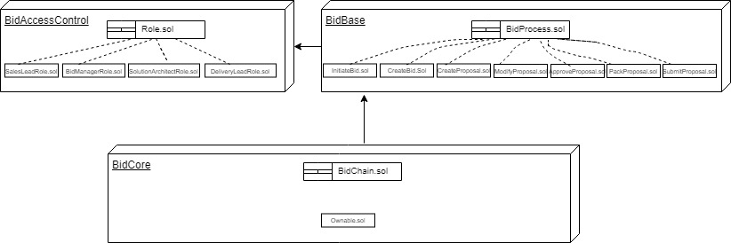

# BID PROCESS SUPPLY CHAIN DAPP

A bid process supply chain DAPP. The actors of the bid process supply chain are Sales Lead, Bid Manager, Solution Architect and Delivery Lead. The asset is the bid document. The summary of the supply chain is as follows:
- Sales Lead initiate a Bid request 
- Bid manager then creates a Bid (The vitutal assets is created here)
- Solution Architect then populates the Bid
- Delivery Lead then reviews the bid.
- After Review, the Delivery lead then either rejects or approve the bid.
- If the bids gets Rejected the Solution Architect then revise the bid.
- Once the bid is approved the Bid Manager then package the bid
- The Sppoved bid is submitted by the Sales Lead 

## UML DIAGRAMS




## Getting Started
**Prerequesites:  
You will need an [Infura](https://infura.io/) account; [Metamask](https://metamask.io/) in your browser; Node, npm and Truffle installed on your computer.**  
See [Resources](#resources) for tools and packages' version used.

1. Clone or download this repository.
2. Install dependencies
```
$ cd Presales_Process
$ npm install
$ cd app
$ npm install
```
3. Start development network and test contracts:
```
$ cd ..
$ truffle develop
$ truffle(develop)>test
```
6. Serve Front-End  
In a second console or close the truffle develop console (`ctrl + c` two times):
```
$ npm run dapp
```
7. Access Front-End at http://localhost:8000

## Contract details
This contract is deployed on the Rinkeby network!  
